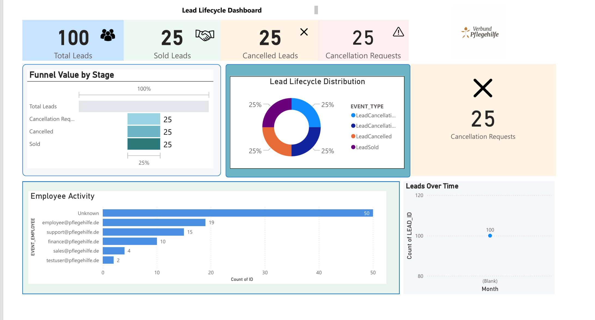

<h2 align="center">Power BI Dashboard</h2>

This Power BI dashboard was created as an additional analytics layer to visualize pipeline-generated Lead Lifecycle events.

The dashboard provides insights into:

<ul>
<li>Total leads processed</li>
<li>Sold leads</li>
<li>Cancelled leads</li>
<li>Cancellation requests</li>
<li>Lead lifecycle distribution</li>
<li>Employee activity</li>
<li>Lead trends over time</li>
</ul>
